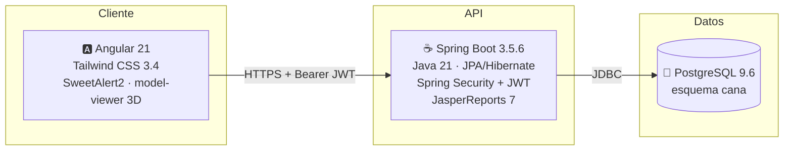

# 🌸 Eventos Caná — Documentación del Sistema

> [!abstract] ¿Qué es este sistema?
> **Eventos Caná** es la plataforma de gestión interna de una empresa de eventos y decoración (floristería). Cubre el ciclo completo del negocio: **cotizar → confirmar pedido → entregar → recolectar → cobrar**, con inventario, servicios de decoración, salones, calendario, dashboard y reportes en PDF.

## 🗺️ Mapa de la documentación

| Nota | Contenido |
|---|---|
| [[01 - Arquitectura General]] | Visión global, diagrama de despliegue, flujo de una petición |
| [[02 - Backend Spring Boot]] | Capas, paquetes, seguridad JWT, diagrama de clases |
| [[03 - API REST]] | Referencia completa de endpoints |
| [[04 - Frontend Angular]] | Estructura, rutas, servicios, permisos por rol |
| [[05 - Base de Datos]] | Diagrama ER, tablas, triggers, catálogos |
| [[06 - Estados y Ciclo de Vida]] | Máquinas de estado de cotización, pedido, pago y logística |
| [[07 - Casos de Uso]] | Actores, diagrama de casos de uso y casos detallados |
| [[08 - Infraestructura y Operaciones]] | Fly.io, Vercel, servidor, SSH, logs, deploy |

## 🧱 Stack tecnológico

| Capa | Tecnología | Versión | Dónde vive |
|---|---|---|---|
| Frontend | Angular (standalone + módulo lazy) | 21.x | **Vercel** |
| Estilos | Tailwind CSS | 3.4 | — |
| Backend | Spring Boot | 3.5.6 (Java 21) | **Fly.io** (`eventos-cana`, región `ord`) |
| Seguridad | Spring Security + JJWT | 0.12.6 | — |
| Reportes | JasperReports (+ jdt, pdf) | 7.0.3 | compilación `.jrxml` en runtime |
| Base de datos | PostgreSQL | 9.6.24 | **Docker Compose** en droplet DigitalOcean |

## ⚡ Referencia rápida

| Recurso | Valor |
|---|---|
| API producción | `https://eventos-cana.fly.dev/cana/api/` |
| API local | `http://localhost:8082/cana/api/` |
| Frontend | Vercel (`*.vercel.app`) — SPA con rewrite a `index.html` |
| IPv4 pública del servidor BD | `167.172.155.223` |
| Conexión SSH | `ssh -i "~/.ssh/id_ed25519" root@167.172.155.223` |
| Logs de la BD (en el servidor) | `docker compose logs -f db` |

> [!tip] Detalle completo de operaciones
> Comandos de deploy, variables de entorno, clave SSH y notas de servidor: [[08 - Infraestructura y Operaciones]].

## 🔁 El negocio en 30 segundos

```mermaid
flowchart LR
    subgraph V["💼 VENTA"]
        direction TB
        A["📋 Crear cotización<br><small>🧮 Contador · 👑 Admin</small>"]
        B["✅ Confirmar cotización<br><small>👑 Admin · 🚚 Jefe Operativo</small>"]
        A --> B
    end

    subgraph O["🚚 OPERACIÓN"]
        direction TB
        C["📦 Pedido confirmado<br><small>🚚 Jefe Operativo</small>"]
        D["🛻 Entrega con viajes<br><small>🧰 Operativo</small>"]
        E["✍️ Constancia firmada<br><small>🧰 Operativo</small>"]
        C --> D --> E
    end

    subgraph F["🏁 CIERRE"]
        direction TB
        G["♻️ Recolección<br><small>🧰 Operativo</small>"]
        H["🏠 Pedido finalizado<br><small>🚚 Jefe Operativo</small>"]
        I["💰 Pagos y estado de cuenta<br><small>🧮 Contador</small>"]
        G --> H --> I
    end

    B == "genera PED-…" ==> C
    E ==> G

    style V fill:#4c6ef522,stroke:#4c6ef5,stroke-width:2px
    style O fill:#f59f0022,stroke:#f59f00,stroke-width:2px
    style F fill:#12b88622,stroke:#12b886,stroke-width:2px
```

- Una **cotización** confirmada genera automáticamente un **pedido** (correlativo `PED-…`) copiando ítems y servicios.
- Cada pedido puede tener **una entrega** (`ENT`) y **una recolección** (`REC`), cada una compuesta de **viajes** que transportan ítems del inventario.
- Los **pagos** (anticipo, abono, pago final, devolución) llevan su propio estado (`PENDIENTE → ANTICIPO/PARCIAL → PAGADO`).
- **Todo cambio de estado queda historiado** por triggers en la base de datos (trazabilidad).
