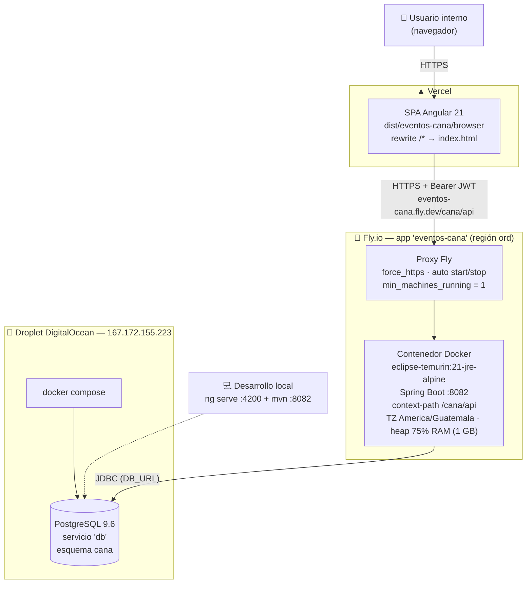
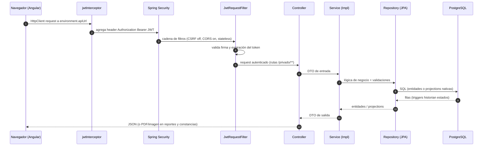

# 🏗️ Arquitectura General

> [!info] Resumen
> Arquitectura clásica de **3 capas desacopladas y desplegadas por separado**: SPA Angular (Vercel) → API REST Spring Boot (Fly.io) → PostgreSQL (Docker en droplet DigitalOcean). La comunicación es 100 % HTTPS con JWT; no hay sesiones en servidor (stateless).

## 🌍 Diagrama de despliegue

> [!warning] Puntos finos del despliegue
> - `min_machines_running = 1` en `fly.toml`: con 0, Fly apaga la máquina y el primer request espera el arranque de Spring (~40-60 s) y el proxy corta antes.
> - La memoria de la VM se define **solo** con `memory = "1gb"` (mezclar `memory` y `memory_mb` deja la máquina en 256 MB y el JVM muere por OOM).
> - El contenedor fija `-Duser.timezone=America/Guatemala`: sin esto todo `LocalDate.now()` corre en UTC y de 18:00 a 23:59 locales el servidor "ya está en mañana" (rompía dashboard y validaciones de fecha).

## 🔀 Flujo de una petición autenticada

- Solo `/publico/**` (login, registro de usuario) queda fuera del filtro JWT — ver [[02 - Backend Spring Boot]].
- CORS se controla con la variable `CORS_ALLOWED_ORIGINS` (localhost:4200, `eventos-cana.fly.dev` y comodín `https://*.vercel.app` para cubrir los previews de Vercel que cambian de URL en cada push).

## 📁 Los dos repositorios

| Repo | Ruta local | Qué contiene |
|---|---|---|
| **CANA** (backend) | `DESARROLLO/CANA` | Spring Boot, `sql/` (esquema + catálogos), `Dockerfile`, `fly.toml`, reportes `.jrxml` |
| **eventos-cana** (frontend) | `DESARROLLO/FRONTEND/eventos-cana` | Angular 21, Tailwind, `vercel.json` |

## 🧭 Decisiones de arquitectura clave

| Decisión | Razón |
|---|---|
| API stateless con JWT (1 h de vida) | Escalar sin sesiones; el frontend guarda el token y lo inyecta por interceptor |
| Trazabilidad por **triggers de BD** y no en Java | Ningún cambio de estado se escapa, ni siquiera un UPDATE manual |
| `.jrxml` compilados en **runtime** con `jasperreports-jdt` | La imagen de producción es un JRE sin `javac`; sin jdt los PDF fallaban en Fly |
| Correlativo de pedido `PED-…` como PK varchar | Legible para el negocio; las tablas hijas referencian el correlativo |
| Esquema `cana` dedicado (+ extensión `unaccent` dentro del esquema) | Las queries llaman `cana.unaccent(...)` calificado; en `public` fallaba al migrar |
| URL del API **compilada** en el bundle Angular | `environment.ts` no es variable de entorno: cambiar el backend implica rebuild + redeploy en Vercel |

➡️ Siguiente: [[02 - Backend Spring Boot]]
