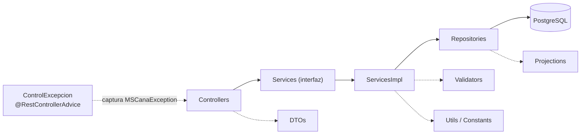
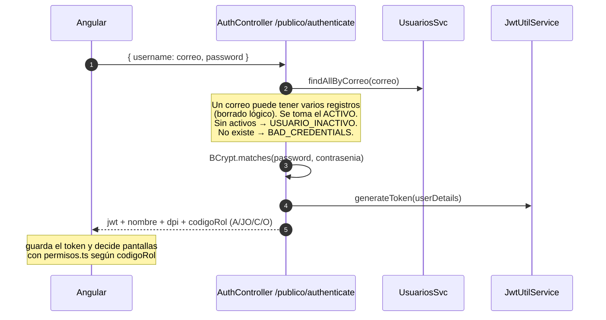
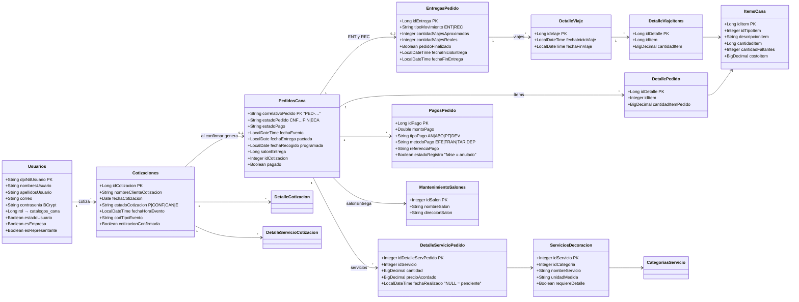
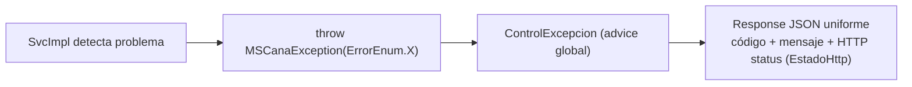

# ☕ Backend — Spring Boot (repo CANA)

> [!info] Ficha técnica
> **Spring Boot 3.5.6 · Java 21 · Maven** — artefacto `com.canabackend:CANA`.
> Context path: **`/cana/api`** · Puerto: **`${PORT:8082}`** · BD: PostgreSQL, esquema **`CANA`** · `ddl-auto=none` (el esquema lo manda `sql/000_esquema_completo.sql`).

## 📦 Estructura de paquetes

```
com.canabackend.cana
├── CanaApplication          ← main
├── StartupProbe             ← instrumentación del arranque
├── controllers/   (28)      ← REST, siempre delgados
├── services/      (interfaces) + services/impl/   ← lógica de negocio
├── repositories/  (26)      ← Spring Data JPA + queries nativas
├── models/        (24)      ← entidades JPA (Lombok)
├── dtos/          (~50)     ← entrada/salida de la API
├── projections/   (~25)     ← lecturas nativas tipadas (interfaces)
├── seguridad/               ← JWT, CORS, Spring Security
├── exceptions/              ← MSCanaException + handler global
├── utils/                   ← constantes de negocio y Jasper
└── validators/              ← validaciones de items y servicios
```



> [!tip] Patrón repetido en todo el backend
> Cada dominio sigue el trío **Controller → Svc (interfaz) → SvcImpl**, con DTOs para entrada/salida y *projections* para lecturas con SQL nativo. Los errores de negocio se lanzan como `MSCanaException(ErrorEnum.X)` y `ControlExcepcion` los convierte en respuestas HTTP consistentes.

## 🔐 Seguridad (paquete `seguridad/`)

| Clase | Rol |
|---|---|
| `WebSecurityConfig` | CSRF off, CORS on, **stateless**; `/publico/**`, `/ws/**`, `/chat-socket/**` públicos, el resto autenticado. Registra el filtro JWT y el `BCryptPasswordEncoder` |
| `JwtRequestFilter` | Extrae y valida el Bearer token en cada request |
| `JwtUtilService` | Genera/valida JWT (JJWT 0.12.6). Expiración **3600 s (1 h)**, refresh 604800 s |
| `UserDetailsServiceImpl` | Carga el usuario por correo desde `cana.usuarios` |
| `CorsConfig` | Lee `cors.allowed-origins` (soporta comodines tipo `https://*.vercel.app`) |
| `AuthenticationRequest/Response` | Payloads de login. La respuesta incluye `jwt, nombre, dpi, rol, codigoRol, nombreRol` |



> [!warning] Secretos
> `application.properties` trae *fallbacks* de desarrollo para `DB_URL`, `DB_USERNAME`, `DB_PASSWORD` y `JWT_SECRET`. En producción **siempre** se fijan como variables de entorno (secrets de Fly); los defaults del repo se consideran quemados.

## 🧬 Diagrama de clases — dominio principal



*(Las clases de trazabilidad `EstadosPedido`, `EstadosPagoPedido`, `DocumentosCotizacion`, `DocumentosEntrega`, etc. se detallan en [[05 - Base de Datos]].)*

## 🧾 Reportes (JasperReports 7.0.3)

- Plantillas en `src/main/resources/reports/`: `cotizacion.jrxml`, `entrega.jrxml`, `estadisticas.jrxml` (+ `logo.png`).
- Se **compilan en runtime**; la dependencia `jasperreports-jdt` embebe el compilador de Eclipse porque la imagen de producción es un JRE sin `javac`.
- Servicios dedicados: `ReporteCotizacionSvc`, `ReporteEntregaSvc`, `ReporteEstadisticoSvc`, `ReportesSvc` + `GraficoUtil` (gráficos para el PDF estadístico).
- Los PDFs generados se **persisten** en `documentos_cotizacion` / `documentos_entrega` (`bytea`), incluida la **constancia de entrega firmada** que se sube como foto (límite multipart: 10 MB).

## ⚠️ Manejo de errores



`ErrorEnum` centraliza los códigos (`COTIZACION_NOT_FOUND`, `I_BAD_CREDENTIALS`, `USUARIO_INACTIVO`, …), y `GeneralResponseException`/`ErrorDetail` dan la forma de la respuesta.

## 🧪 Tests

| Test | Qué cubre |
|---|---|
| `CanaApplicationTests` | Arranque del contexto |
| `CicloLogisticoCompletoTest` | El ciclo entrega → viajes → recolección → finalizado de punta a punta |
| `EntregasQueriesNativasTest` | Las queries nativas de entregas/recolecciones |

## 🛠️ Comandos útiles

```bash
mvn spring-boot:run
```

```bash
mvn clean package -DskipTests
```

> [!warning] Build local en Windows
> El `JAVA_HOME` del sistema es JDK 8: hay que apuntar explícitamente a un **JDK 21** para compilar (el error que da JDK 8 es engañoso). El Dockerfile no sufre esto porque fija `maven:3.9-eclipse-temurin-21`.

➡️ Siguiente: [[03 - API REST]]
