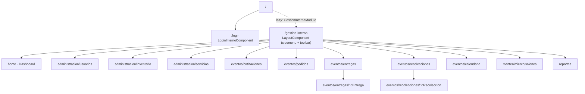
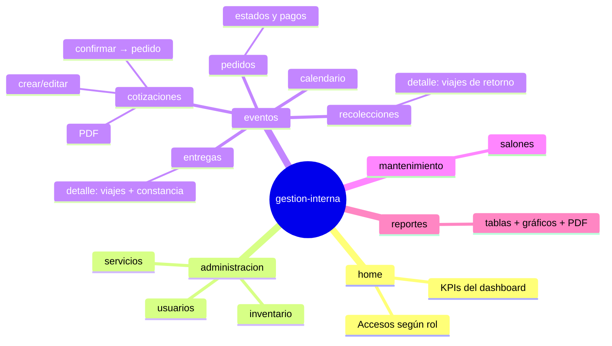

# 🅰️ Frontend — Angular (repo eventos-cana)

> [!info] Ficha técnica
> **Angular 21** (bootstrap standalone + un módulo lazy) · **Tailwind CSS 3.4** · SweetAlert2 · `@google/model-viewer` (visor 3D) · tests con **Vitest**. Desplegado en **Vercel** como SPA (`vercel.json` reescribe todo a `index.html`).

## 🌐 Configuración de entornos

| Archivo | `apiUrl` | Uso |
|---|---|---|
| `environments/environment.ts` | `https://eventos-cana.fly.dev/cana/api/` | `ng build` (producción, **valor compilado en el bundle**) |
| `environments/environment.development.ts` | `http://localhost:8082/cana/api/` | `ng serve` |

> [!warning] La URL del API se hornea en el build
> Si el backend cambia de dominio hay que editar `environment.ts` y volver a desplegar en Vercel. No es una variable de entorno en runtime.

## 🗺️ Mapa de rutas



## 🔐 Seguridad en el cliente

- **`security/auth.interceptor.ts`** (`jwtInterceptorInterceptor`): si hay token y la URL empieza por `environment.apiUrl`, clona el request con `Authorization: Bearer <jwt>`.
- **`security/permisos.ts`**: fuente única de qué pantallas ve cada rol (la usan el sidemenu y el home). Se decide por el **`codigoRol`** que devuelve el login. Un rol desconocido solo ve `home`.

| Pantalla | A (Admin) | JO (Jefe Operativo) | C (Contador) | O (Operativo) |
|---|:---:|:---:|:---:|:---:|
| home | ✅ | ✅ | ✅ | ✅ |
| eventos/calendario | ✅ | ✅ | ✅ | ✅ |
| administracion/usuarios | ✅ | ❌ | ❌ | ❌ |
| administracion/inventario | ✅ | ✅ | ✅ | ❌ |
| administracion/servicios | ✅ | ✅ | ✅ | ❌ |
| eventos/cotizaciones | ✅ | ✅ | ✅ | ❌ |
| eventos/pedidos | ✅ | ✅ | ✅ | ✅ |
| eventos/entregas | ✅ | ✅ | ❌ | ✅ |
| eventos/recolecciones | ✅ | ✅ | ❌ | ✅ |
| mantenimiento/salones | ✅ | ❌ | ❌ | ❌ |
| reportes | ✅ | ❌ | ✅ | ❌ |

## 🧩 Servicios (`app/services/`)

| Servicio | Habla con | Notas |
|---|---|---|
| `sesionService` / `token.service` | `/publico/authenticate` | Login, guarda JWT y datos del usuario |
| `usuario.service` | `/usuarios`, `/publico/guardarUsuario` | CRUD usuarios |
| `cotizacion.service` | `/cotizaciones` | CRUD + confirmar + PDF |
| `pedido.service` | `/pedidos` | CRUD + cambio de estado |
| `entrega.service` | `/entregas` | Entregas, viajes, constancias |
| `recoleccion.service` | `/recolecciones` | Recolecciones y viajes |
| `pago.service` | `/pagosPedido` | Pagos y estado de cuenta |
| `item.service` | `/items` | Inventario |
| `servicio.service` | `/servicios` | Servicios y categorías |
| `salon.service` | `/salones` | Salones |
| `catalogo.service` | `/catalogosCana` | Catálogos genéricos |
| `calendario.service` | `/calendario` | Agenda |
| `dashboard.service` | `/dashboard` | KPIs del home |
| `reporte.service` | `/reportes` | Reporte general + PDF |
| `loading.service` | — | Overlay de carga global |
| `SharedDataService` | — | Estado compartido entre componentes |

## 🧱 Componentes compartidos (`app/shared/`)

| Componente | Para qué |
|---|---|
| `sidemenu` | Menú lateral filtrado por `permisos.ts` |
| `toast` (+ `toast.service`) | Notificaciones |
| `loading` | Spinner global conectado a `loading.service` |
| `date-picker` | Selector de fechas propio |
| `fecha.util` | Utilidades de fecha (zona horaria del negocio) |
| `document-viewer` | Visor de PDFs/constancias |
| `trazabilidad/trazabilidad-modal` | Modal con el historial de estados (cotización/pedido) |
| `graficos/` (`grafico-barras`, `grafico-dona`, `grafico-ranking`, `paleta`) | Gráficos del dashboard y reportes |
| `modelo-3d` | Visor 3D con `@google/model-viewer` |

## 🖥️ Pantallas del módulo `gestion-interna`



## 🛠️ Comandos

```bash
npm start
```

```bash
npm run build
```

```bash
npm test
```

➡️ Siguiente: [[05 - Base de Datos]]
