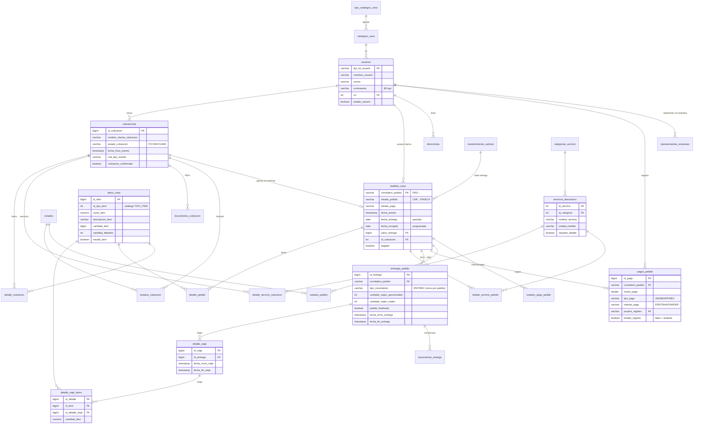
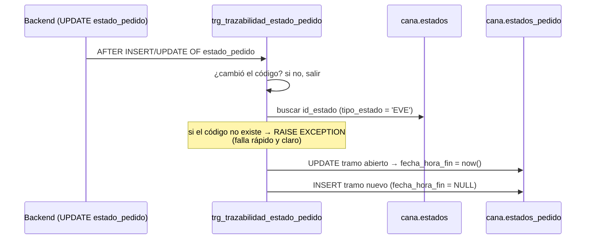

# 🐘 Base de Datos — PostgreSQL 9.6, esquema `cana`

> [!info] Ficha técnica
> **PostgreSQL 9.6.24** corriendo en **Docker Compose** (servicio `db`) en el droplet `167.172.155.223`. Todo vive en el esquema **`cana`** (25 tablas, 2 funciones trigger, extensión `unaccent` instalada **dentro del esquema**). Fuente de verdad: `sql/000_esquema_completo.sql` + `sql/001_datos_catalogos.sql`.

> [!warning] Reglas de oro al tocar la BD
> - Es **PG 9.6**: para columnas autoincrementales usar `BIGSERIAL`, **no** `GENERATED ALWAYS AS IDENTITY` (sintaxis de PG 10+).
> - La extensión `unaccent` debe vivir **en el esquema `cana`**: las queries la invocan calificada (`cana.unaccent(...)`). En `public` fallan las búsquedas de `ItemsCanaRepository` y `ServiciosDecoracionRepository`.
> - `ddl-auto=none`: Hibernate **no** crea ni altera tablas; los cambios de esquema se hacen con scripts SQL.
> - El dump completo (`dump/dump.sql`) trae además un esquema `neon_auth` — residuo de cuando la BD estuvo en Neon; el aplicativo solo usa `cana`.

## 🧭 Diagrama Entidad-Relación



*(Se omiten en el gráfico las columnas secundarias; el detalle completo está en el script `sql/000_esquema_completo.sql`.)*

## 📚 Las 25 tablas por dominio

| Dominio | Tablas |
|---|---|
| **Seguridad y personas** | `usuarios` (PK = DPI/NIT), `direcciones`, `representantes_empresas` |
| **Catálogos** | `tipo_catalogos_cana` → `catalogos_cana` (roles, tipos de ítem/evento/pago, modalidades), `estados` (COT/EVE/PAGO) |
| **Cotización** | `cotizaciones`, `detalle_cotizacion` (ítems), `detalle_servicio_cotizacion`, `documentos_cotizacion` (PDF en `bytea`), `estados_cotizacion` (historial) |
| **Pedido** | `pedidos_cana`, `detalle_pedido`, `detalle_servicio_pedido` (`fecha_realizado` NULL = pendiente), `estados_pedido` (historial) |
| **Logística** | `entregas_pedido` (filas ENT/REC), `detalle_viaje`, `detalle_viaje_items`, `documentos_entrega` (constancias, incl. firmada) |
| **Pagos** | `pagos_pedido`, `estados_pago_pedido` (historial) |
| **Recursos** | `items_cana` (inventario), `categorias_servicio`, `servicios_decoracion`, `mantenimiento_salones` |

> [!note] Detalles de diseño que importan
> - `entregas_pedido` tiene **índice único** `(correlativo_pedido, tipo_movimiento)`: un pedido tiene *a lo sumo* una entrega (`ENT`) y una recolección (`REC`).
> - En `pedidos_cana`, `fecha_entrega` y `fecha_recogido` son fechas **de agenda** (pactadas); lo realmente ejecutado vive en las filas ENT/REC de `entregas_pedido`.
> - Borrado lógico en casi todo: `estado_registro` / `estado_usuario` / `estado_item` / `estado_servicio` / `estado_salon` en `false`.
> - Los PDFs y fotos se guardan **dentro de la BD** (`bytea` en `documentos_cotizacion` / `documentos_entrega`).
> - Índices de apoyo: `detalle_viaje(fecha_inicio_viaje)`, `detalle_viaje(id_entrega)`, `detalle_viaje_items(id_detalle_viaje)`, `documentos_entrega(id_entrega)`, `pagos_pedido(correlativo_pedido)`, `estados_pago_pedido(correlativo_pedido)`.

## ⚙️ Triggers de trazabilidad



| Trigger | Tabla vigilada | Historial que alimenta | Filtro en `estados` |
|---|---|---|---|
| `trg_trazabilidad_estado_cotizacion` → `fn_trazabilidad_estado_cotizacion()` | `cotizaciones.estado_cotizacion` | `estados_cotizacion` | `tipo_estado = 'COT'` |
| `trg_trazabilidad_estado_pedido` → `fn_trazabilidad_estado_pedido()` | `pedidos_cana.estado_pedido` | `estados_pedido` | `tipo_estado = 'EVE'` |

El historial funciona por **tramos**: cada fila tiene `fecha_hora_inicio` y `fecha_hora_fin`; el tramo con `fecha_hora_fin IS NULL` es el estado vigente. *(El historial de pago —`estados_pago_pedido`— lo mantiene el backend, no un trigger.)*

## 🏷️ Catálogos precargados (`001_datos_catalogos.sql`)

| Tipo catálogo | Códigos |
|---|---|
| **ROLES** | `A` Administrador/a General · `JO` Jefe Operativo · `C` Contador · `O` Operativo |
| **TIPO_ITEM** | `C` Cristalería · `MA` Mantelería · `M` Mobiliario · `OT` Otros |
| **TIPO_EVENTOS** | 18 tipos: `BO` Boda, `XV` XV Años, `AV` Aniversario, `CP` Cumpleaños, `EC` Corporativo, `ER` Religioso, `EF` Familiar, `GR` Graduación, `ECA` Caritativo, `BS` Baby Shower, `BP` Bautizo/1ª Comunión, `FH` Funeral/Homenaje, `ED` Deportivo, `EGA` Gastronómico, `CON` Convivio, `CF` Concierto/Festival, `DS` Despedida, `OTR` Otros |
| **TIPO_PAGO** | `AN` Anticipo · `ABO` Abono · `PF` Pago final · `DEV` Devolución |
| **MODALIDADES_PAGO** | `EFE` Efectivo · `TRAN` Transferencia · `TAR` Tarjeta · `DEP` Depósito |

Los **estados** (tabla `estados`, tipos `COT`/`EVE`/`PAGO`) se detallan con sus transiciones en [[06 - Estados y Ciclo de Vida]].

## 🔧 Operación de la BD

Conectarse al servidor y ver logs en vivo:

```bash
ssh -i "~/.ssh/id_ed25519" root@167.172.155.223
```

```bash
docker compose logs -f db
```

Más comandos (backups, restauración del dump, variables `DB_*`): [[08 - Infraestructura y Operaciones]].

➡️ Siguiente: [[06 - Estados y Ciclo de Vida]]
