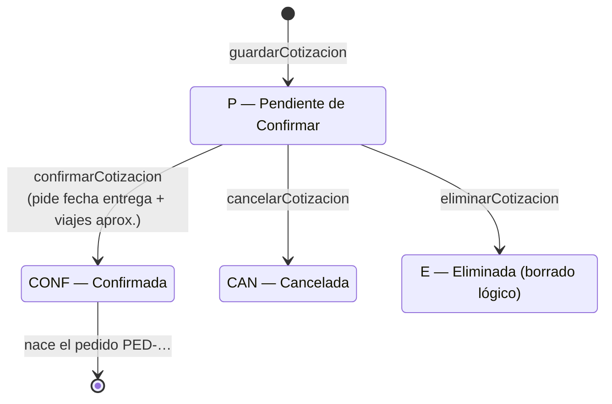
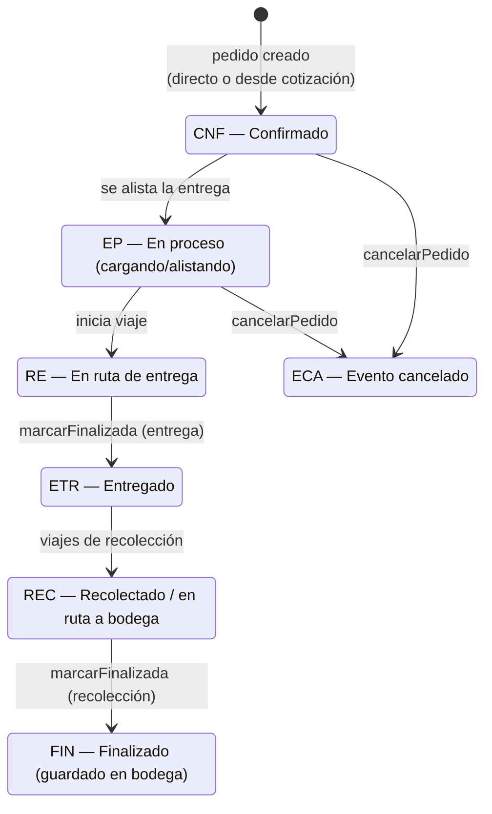
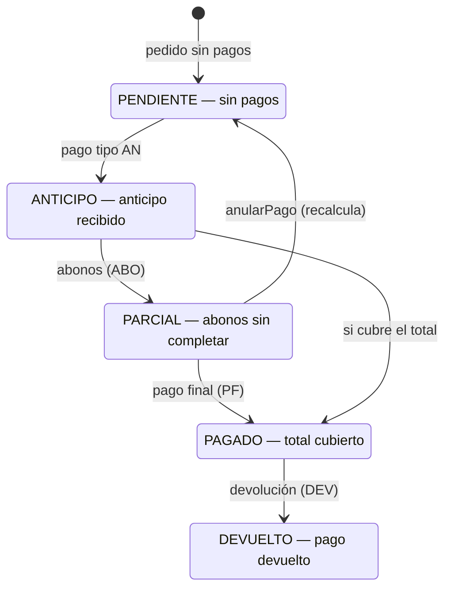
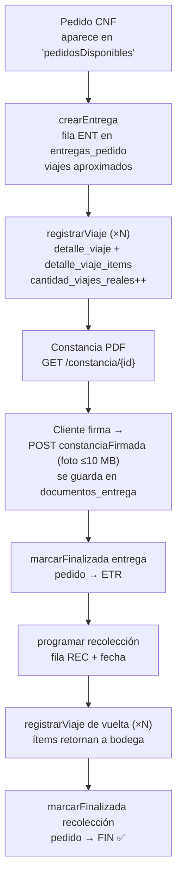

# 🔄 Estados y Ciclo de Vida

> [!info] Cómo leer esta nota
> El sistema tiene **tres máquinas de estado** (cotización `COT`, pedido/evento `EVE`, pago `PAGO`) definidas en la tabla `cana.estados`. Cada transición queda historiada automáticamente ([[05 - Base de Datos#⚙️ Triggers de trazabilidad|triggers]]) y el frontend la muestra en el modal de trazabilidad.

## 📋 Cotización (`tipo_estado = COT`)

| Código | Nombre | Nota |
|---|---|---|
| `P` | Pendiente de Confirmar | Estado inicial al guardar |
| `CONF` | Confirmada | **Dispara la creación automática del pedido** copiando ítems y servicios |
| `CAN` | Cancelada | — |
| `E` | Eliminada | Borrado lógico |
| `C` | Creada | *Inactivo en el catálogo (ya no se usa)* |

## 📦 Pedido / Evento (`tipo_estado = EVE`)

| Código | Nombre | Quién lo mueve |
|---|---|---|
| `CNF` | Confirmado | Al crear el pedido |
| `EP` | En proceso | Logística: se está cargando/alistando |
| `RE` | En ruta de entrega | Al llevar el pedido |
| `ETR` | Entregado | Al cerrar la entrega (`ENT`) |
| `REC` | Recolectado / en ruta a bodega | Durante la recolección |
| `FIN` | Finalizado | Al cerrar la recolección (`REC`) — todo de vuelta en bodega |
| `ECA` | Evento cancelado | Cancelación por cliente o empresa |
| `M`, `PR` | Montando / Pendiente de recolección | *Inactivos en el catálogo* |

## 💰 Estado de pago (`tipo_estado = PAGO`)

> [!tip] El estado de pago se **recalcula** con cada movimiento
> `registrarPago` y `anularPago` recomputan el estado comparando lo pagado contra el total del pedido, actualizan `pedidos_cana.estado_pago` + flag `pagado`, y escriben el tramo en `estados_pago_pedido` (aquí lo historia el backend, no un trigger).

## 🚚 Ciclo logístico completo (entrega + recolección)

- Cada **viaje** transporta un subconjunto de los ítems del pedido (`detalle_viaje_items`); así se soportan pedidos que no caben en un solo camión.
- La fila `REC` reutiliza la misma tabla `entregas_pedido` diferenciada por `tipo_movimiento`, con la restricción de **una fila por tipo por pedido**.
- Este flujo completo está cubierto por el test `CicloLogisticoCompletoTest`.

➡️ Siguiente: [[07 - Casos de Uso]]
