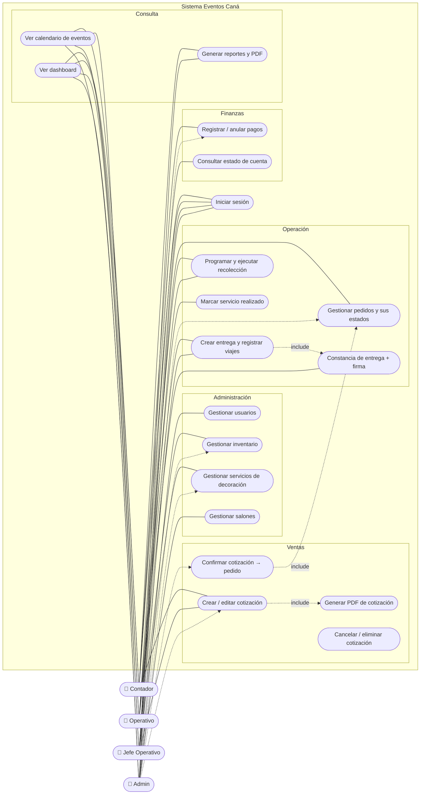

# 🎭 Casos de Uso

> [!info] Actores del sistema
> Los cuatro roles del catálogo `ROLES` (ver [[04 - Frontend Angular#🔐 Seguridad en el cliente|permisos por rol]]):
> - **👑 Administrador/a General (`A`)** — acceso total.
> - **🚚 Jefe Operativo (`JO`)** — logística: inventario, servicios, cotizaciones, pedidos, entregas, recolecciones.
> - **🧮 Contador (`C`)** — pagos, cotizaciones, pedidos, inventario, servicios y reportes.
> - **🧰 Operativo (`O`)** — ejecución: pedidos, entregas y recolecciones.

## 🗺️ Diagrama general de casos de uso

---

## CU-01 · Iniciar sesión

| | |
|---|---|
| **Actores** | Todos |
| **Precondición** | Usuario registrado con `estado_usuario = true` |
| **Flujo principal** | 1️⃣ El usuario ingresa correo y contraseña en `/login` → 2️⃣ `POST /publico/authenticate` → 3️⃣ el backend busca registros por correo y toma el **activo** → 4️⃣ valida BCrypt → 5️⃣ emite JWT (1 h) con nombre, DPI y rol → 6️⃣ el frontend guarda el token y arma el menú con `permisos.ts` |
| **Flujos alternos** | 3a. Correo registrado pero sin registro activo → error "usuario inactivo". 4a. Contraseña incorrecta o correo inexistente → "credenciales inválidas" |
| **Postcondición** | Sesión stateless activa; toda petición lleva `Authorization: Bearer` |

## CU-02 · Crear cotización

| | |
|---|---|
| **Actores** | Admin, Jefe Operativo, Contador |
| **Precondición** | Catálogos de tipos de evento, ítems y servicios cargados |
| **Flujo principal** | 1️⃣ Captura datos del cliente (nombre, teléfono, dirección, DPI/NIT opcional), tipo y fecha/hora del evento → 2️⃣ agrega ítems de inventario (`detalle_cotizacion`) y servicios con precio cotizado (`detalle_servicio_cotizacion`) → 3️⃣ `POST /cotizaciones/privado/guardarCotizacion` → 4️⃣ la cotización nace en estado `P` (el trigger abre el primer tramo de historial) |
| **Extensión** | CU-03: generar el PDF para enviarlo al cliente |
| **Postcondición** | Cotización `P` visible en el listado y en trazabilidad |

## CU-03 · Generar PDF de cotización

| | |
|---|---|
| **Actores** | Admin, JO, Contador |
| **Flujo principal** | 1️⃣ `GET /cotizaciones/privado/documento/{id}` → 2️⃣ Jasper compila `cotizacion.jrxml` en runtime y llena con los detalles → 3️⃣ el PDF se guarda en `documentos_cotizacion` y se descarga con `Content-Disposition` |

## CU-04 · Confirmar cotización (nace el pedido)

| | |
|---|---|
| **Actores** | Admin, Jefe Operativo |
| **Precondición** | Cotización en estado `P` |
| **Flujo principal** | 1️⃣ El usuario confirma indicando **fecha de entrega** y **cantidad de viajes aproximados** → 2️⃣ `PUT /cotizaciones/privado/confirmarCotizacion/{id}` → 3️⃣ estado → `CONF` → 4️⃣ **transacción**: se crea `pedidos_cana` con correlativo `PED-…` copiando cliente, evento, ítems y servicios (precio cotizado → precio acordado) → 5️⃣ el pedido nace `CNF` y su estado de pago `PENDIENTE` |
| **Flujos alternos** | 2a. Ya estaba confirmada → solo actualiza datos, **no** duplica el pedido. Fechas en el pasado → rechazo |
| **Postcondición** | Pedido visible en Pedidos y como "disponible" para crear entrega |

## CU-05 · Crear pedido directo (sin cotización)

| | |
|---|---|
| **Actores** | Admin, JO, Contador |
| **Flujo principal** | 1️⃣ `POST /pedidos/privado/guardarPedido` con cliente provisional, fechas (validadas no-pasadas), salón opcional, ítems y servicios → 2️⃣ correlativo `PED-…` generado → 3️⃣ estado `CNF` |

## CU-06 · Ejecutar entrega

| | |
|---|---|
| **Actores** | Jefe Operativo, Operativo |
| **Precondición** | Pedido `CNF` sin fila `ENT` (aparece en `pedidosDisponibles`) |
| **Flujo principal** | 1️⃣ `POST /entregas/privado/crearEntrega` → 2️⃣ por cada camión: `registrarViaje` con los ítems transportados (suma `cantidad_viajes_reales`) → 3️⃣ genera constancia PDF → 4️⃣ el cliente firma; se fotografía y sube (`POST constanciaFirmada`, ≤ 10 MB) → 5️⃣ `marcarFinalizada` → pedido pasa a `ETR` |
| **Reglas** | Solo una fila `ENT` por pedido (índice único). El detalle de viajes queda por ítem para trazar qué salió de bodega |

## CU-07 · Ejecutar recolección

| | |
|---|---|
| **Actores** | Jefe Operativo, Operativo |
| **Precondición** | Pedido `ETR` (entregado) |
| **Flujo principal** | 1️⃣ `PUT /recolecciones/privado/programar/{id}` fija fecha y viajes → 2️⃣ `registrarViaje` de retorno con los ítems recuperados → 3️⃣ `marcarFinalizada` → pedido pasa a `FIN` (todo en bodega) |
| **Postcondición** | Ciclo logístico cerrado; el pedido sale de las vistas operativas |

## CU-08 · Registrar pago

| | |
|---|---|
| **Actores** | Contador, Admin |
| **Precondición** | Pedido existente; usuario que registra queda auditado (`usuario_registro`) |
| **Flujo principal** | 1️⃣ `POST /pagosPedido/privado/registrarPago` con monto, tipo (`AN`/`ABO`/`PF`/`DEV`), método (`EFE`/`TRAN`/`TAR`/`DEP`) y referencia → 2️⃣ el backend recalcula el estado de pago (`PENDIENTE → ANTICIPO → PARCIAL → PAGADO`) → 3️⃣ historial en `estados_pago_pedido` |
| **Flujo alterno** | Anulación: `PUT /anularPago/{idPago}` (lógica, `estado_registro=false`) y recalcula el estado |
| **Consulta** | `GET /estadoCuenta/{correlativo}`: total, pagado, saldo |

## CU-09 · Gestionar inventario / servicios / salones / usuarios

| | |
|---|---|
| **Actores** | Según pantalla: usuarios y salones solo Admin; inventario y servicios también JO y Contador |
| **Flujo común** | Listar → crear → editar → **inactivar (borrado lógico)**. Los ítems llevan tipo (Cristalería/Mantelería/Mobiliario/Otros), stock y faltantes; los servicios llevan categoría, unidad de medida y flag `requiere_detalle`; los usuarios llevan rol y contraseña BCrypt |
| **Regla** | Las búsquedas de ítems/servicios usan `cana.unaccent` (insensibles a tildes) |

## CU-10 · Consultar dashboard, calendario y reportes

| | |
|---|---|
| **Actores** | Dashboard/calendario: todos · Reportes: Admin y Contador |
| **Flujo principal** | Dashboard (`/dashboard/privado/resumen`): KPIs del día y próximos eventos. Calendario (`/calendario/privado/agenda`): eventos + entregas + recolecciones. Reportes (`/reportes/privado/general[/pdf]`): resumen, serie mensual, ranking de clientes, cartera y distribución, con gráficos y export PDF Jasper |
| **Regla clave** | "Hoy" se calcula en zona `America/Guatemala` (fijada por JVM en el contenedor) — sin eso el dashboard contaba entregas de mañana como de hoy |

➡️ Siguiente: [[08 - Infraestructura y Operaciones]]
