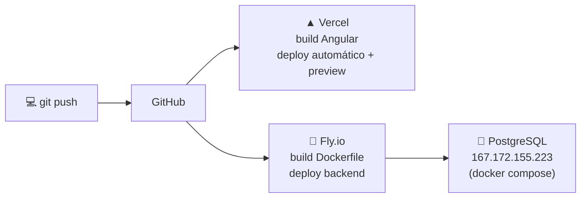

# 🛠️ Infraestructura y Operaciones

> [!danger] Nota de seguridad
> Esta nota contiene datos de infraestructura (IP, clave **pública** SSH). La clave privada `~/.ssh/id_ed25519` **nunca** debe copiarse aquí ni commitearse. Si este repo llegara a hacerse público, revisar antes esta carpeta.

## 🖥️ Servidor de base de datos (DigitalOcean)

| Dato | Valor |
|---|---|
| IPv4 pública | `167.172.155.223` |
| Usuario | `root` |
| Servicio | PostgreSQL 9.6 vía **Docker Compose** (servicio `db`) |

### 🔑 Acceso SSH

Clave pública autorizada en el servidor:

```
ssh-ed25519 AAAAC3NzaC1lZDI1NTE5AAAAIEPu0r5eEkYITE52lB8en3yE+FVTajwhgvH47vIgAOv1 conco@Eli
```

Conectarse:

```bash
ssh -i "~/.ssh/id_ed25519" root@167.172.155.223
```

### 📜 Logs de la base de datos

Ya dentro del servidor (en el directorio del `docker-compose.yml`):

```bash
docker compose logs -f db
```

Otros comandos útiles en el servidor:

```bash
docker compose ps
```

```bash
docker compose restart db
```

## 🎈 Backend en Fly.io

> [!warning] Deploy solo por web
> No hay `flyctl` instalado localmente: **todo se opera desde fly.io (dashboard web) + GitHub**. El deploy se dispara desde el repo; secrets y escalado se tocan en el dashboard.

| Dato | Valor |
|---|---|
| App | `eventos-cana` · región `ord` |
| URL | `https://eventos-cana.fly.dev/cana/api` |
| VM | 1 CPU compartida · **1 GB** (`memory`, nunca mezclar con `memory_mb`) |
| Disponibilidad | `min_machines_running = 1` (evita cold start de ~40-60 s) |
| Imagen | Build 2 etapas: `maven:3.9-eclipse-temurin-21` → `eclipse-temurin:21-jre-alpine` |
| JVM | `-Duser.timezone=America/Guatemala · -XX:MaxRAMPercentage=75` |

### Variables de entorno del backend

| Variable | Dónde | Propósito |
|---|---|---|
| `DB_URL`, `DB_USERNAME`, `DB_PASSWORD` | **Secrets de Fly** | Conexión JDBC a la BD del droplet |
| `JWT_SECRET` | **Secret de Fly** | Firma de tokens (el default del repo es solo para local) |
| `CORS_ALLOWED_ORIGINS` | `[env]` de `fly.toml` | `http://localhost:4200, https://eventos-cana.fly.dev, https://*.vercel.app` |
| `SQL_LOG_LEVEL` | `[env]` de `fly.toml` | `warn` en prod (loguear cada query en Fly cuesta y no aporta) |
| `PORT` | Inyectada por la plataforma | `server.port=${PORT:8082}` |

## ▲ Frontend en Vercel

| Dato | Valor |
|---|---|
| Build | `npm run build` → `dist/eventos-cana/browser` |
| Routing | `vercel.json` reescribe `/*` → `/index.html` (SPA) |
| Previews | Cada push estrena URL `*.vercel.app` — cubiertas por el comodín CORS del backend |
| API URL | Compilada en `environment.ts`; si cambia el backend → editar y redeploy |

## 🚀 Flujo de despliegue



## 🧯 Runbook rápido

| Síntoma | Primero revisar |
|---|---|
| API caída / lenta al primer request | Dashboard de Fly: ¿máquina detenida? (`min_machines_running` debe ser 1) |
| Errores de BD en el backend | `ssh` al droplet → `docker compose logs -f db`; verificar contenedor `db` arriba |
| PDF falla en producción | Debe existir `jasperreports-jdt` en el pom (el JRE alpine no trae `javac`) |
| CORS bloqueado desde un preview de Vercel | `CORS_ALLOWED_ORIGINS` debe incluir `https://*.vercel.app` |
| Fechas corridas un día | Confirmar `-Duser.timezone=America/Guatemala` en el ENTRYPOINT del contenedor |
| OOM al arrancar en Fly | `fly.toml` con **solo** `memory = "1gb"` |
| Login rechaza usuario válido | ¿Registro activo? (un correo puede tener varios registros; solo cuenta el activo) |
| Búsquedas ignoran resultados con tildes | Extensión `unaccent` debe estar **en el esquema `cana`** |

## 💾 Dump y restauración

- Último dump: `Cana/dump/dump.sql` (pg_dump 9.6, esquemas `cana` + `neon_auth` residual de Neon).
- Esquema limpio versionado en el repo: `sql/000_esquema_completo.sql` + catálogos en `sql/001_datos_catalogos.sql`.
- Restaurar en un Postgres 9.6 vacío: aplicar `000` → `001` (o el dump completo con `psql -f dump.sql`).

⬅️ Volver al índice: [[00 - Inicio]]
